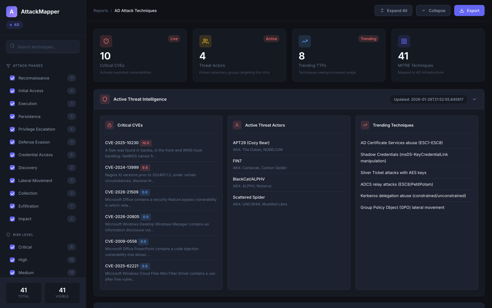

<h1 align="center">
  <br>
  
  <br>
  AttackMapper
  <br>
</h1>

<h4 align="center">Attack Path Visualization & Threat Intelligence Platform</h4>

<p align="center">
  
  
  
  
</p>

<p align="center">
  <a href="#features">Features</a> •
  <a href="#installation">Installation</a> •
  <a href="#usage">Usage</a> •
  <a href="#threat-intelligence">Threat Intel</a> •
  <a href="#contributing">Contributing</a>
</p>

<p align="center">
  
</p>

---

## Overview

**AttackMapper** is a CLI tool for red team operations that generates attack paths, maps techniques to the MITRE ATT&CK framework, and integrates real-time threat intelligence. Generate interactive HTML reports with attack flow visualizations.

## Features

| Feature | Description |
|---------|-------------|
| **Attack Path Mapping** | Visualize complete kill chains from reconnaissance to impact |
| **MITRE ATT&CK Integration** | Techniques mapped to official ATT&CK framework |
| **Live Threat Intel** | Real-time CVEs, threat actors, and trending TTPs |
| **Multi-Infrastructure** | AD, AWS, Azure, GCP, and Network attack paths |
| **Interactive Reports** | Modern HTML dashboards with filtering and search |

### Supported Infrastructure

```
┌─────────────────┬─────────────────────────────────────────┐
│ Active Directory│ Kerberos, ADCS, GPO, DCSync, Golden Ticket│
│ AWS             │ IAM, S3, Lambda, EC2 privilege escalation │
│ Azure           │ Entra ID, Key Vault, Managed Identities   │
│ GCP             │ IAM, Cloud Functions, Service Accounts    │
│ Network         │ Traditional network attack vectors        │
└─────────────────┴─────────────────────────────────────────┘
```

## Installation

```bash
# Clone the repository
git clone https://github.com/Sai-Jagadeesh/attackmapper.git
cd attackmapper

# Install
pip install -e .

# Verify
attackmapper --help
```

## Usage

### Generate Attack Paths

```bash
# Active Directory
attackmapper ad

# Cloud Infrastructure
attackmapper aws
attackmapper azure
attackmapper gcp

# Network
attackmapper network
```

### Generate HTML Reports

```bash
# Full attack chain report
attackmapper full-chain --infra ad --output report.html --format html

# Filter by attack phase
attackmapper ad --category credential_access
```

### Threat Intelligence

```bash
# Update threat feeds
attackmapper update-intel

# View threat intel
attackmapper threat-intel --infra ad
```

## Threat Intelligence

AttackMapper integrates live threat intelligence from multiple sources:

| Source | Data |
|--------|------|
| **CISA KEV** | Known Exploited Vulnerabilities |
| **AlienVault OTX** | Open Threat Exchange feeds |
| **CVE Database** | Real-time vulnerability tracking |

### Configuration

```bash
cp .env.example .env
```

```env
# AlienVault OTX API Key (free at otx.alienvault.com)
OTX_API_KEY=your_api_key_here
```

## Commands

| Command | Description |
|---------|-------------|
| `attackmapper ad` | Active Directory attack paths |
| `attackmapper aws` | AWS cloud attack paths |
| `attackmapper azure` | Azure cloud attack paths |
| `attackmapper gcp` | GCP cloud attack paths |
| `attackmapper network` | Network attack paths |
| `attackmapper full-chain` | Generate complete attack chain |
| `attackmapper threat-intel` | View threat intelligence |
| `attackmapper update-intel` | Update threat intel feeds |

## Contributing

```bash
# Fork and clone
git checkout -b feature/your-feature
git commit -m 'Add feature'
git push origin feature/your-feature
# Open a Pull Request
```

## License

MIT License - see [LICENSE](LICENSE) for details.

---

<p align="center">
  <sub>Built for Red Team Operations</sub>
</p>
